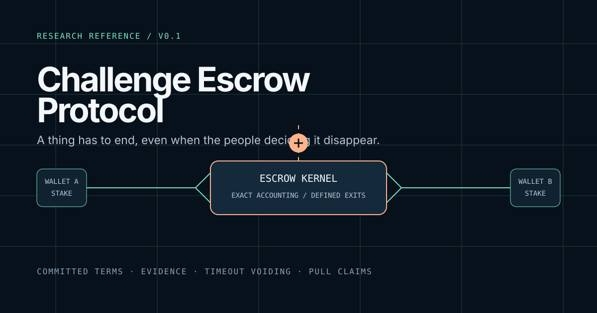
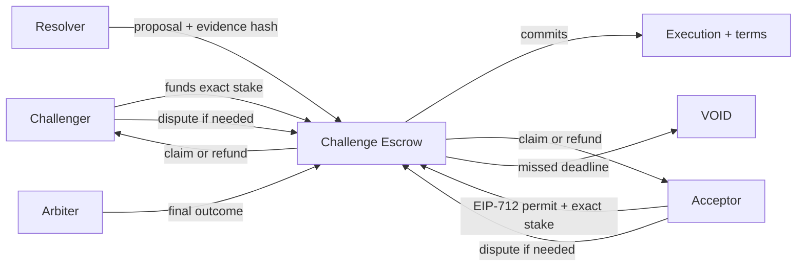

<p align="center">
  
</p>

<p align="center">
  <a href="https://github.com/Horwood/challenge-escrow-protocol/actions/workflows/verify.yml"></a>
  <a href="LICENSE"></a>
  <a href="SECURITY.md"></a>
</p>

# Challenge Escrow Protocol

> Equal-stake challenge escrow with committed terms, evidence-linked resolution,
> and a defined financial outcome when the people deciding the result disappear.

This is a small, direct reference implementation for a two-wallet challenge.
It is deliberately not a product, an oracle, a custody layer, a deployment kit,
or a claim that real-value use is safe. It is the protocol work underneath that
kind of product, extracted so the interesting parts can stand on their own.

**Research status.** Unaudited code. Local and testnet use with valueless assets
only. Read [the security policy](SECURITY.md) before reading anything else that
might look deployable.

## Start from the question you actually have

| If you want to... | Read this |
| --- | --- |
| understand the mechanism in ten minutes | [Protocol semantics](docs/PROTOCOL.md) |
| see why the design ended up in this shape | [Research evolution](docs/EVOLUTION.md) |
| review assumptions, failures, and remaining gaps | [Threat model](docs/THREAT-MODEL.md) and [security review](docs/SECURITY-REVIEW.md) |
| reproduce commitments outside Solidity | [Public vectors](spec/vectors/commitments-v1.json) and [their verifier](tools/verify-vectors.mjs) |
| read or change the code | [Reading guide](docs/READING-GUIDE.md) and [contribution notes](CONTRIBUTING.md) |

## The whole idea

Two named wallets lock the same exact amount of one ERC-20 asset against a
committed execution and a committed terms artifact. The contract handles
accounting, authorization, deadlines, and finality. A resolver proposes an
outcome from evidence; an arbiter exists for disputes. If either authority does
not act in time, the protocol reaches `VOID` and creates refunds. Funds do not
wait forever for somebody to answer a message.



## Money, authority, and failure have separate jobs

| Part | What it can do | What it cannot do |
| --- | --- | --- |
| Contract | hold one configured token, create entitlements, enforce deadlines | interpret evidence, change its release, withdraw as an owner |
| Participants | fund, accept, dispute, claim, refund | redirect another wallet's entitlement |
| Resolver | propose `A`, `B`, or `VOID` with an evidence hash | move escrowed funds or resolve after its deadline |
| Arbiter | decide a disputed result inside a fixed window | participate financially or extend the window |
| Pauser | stop new exposure during an incident | block disputes, timeouts, claims, or refunds |

The system makes one opinionated choice: authority failure is a protocol event,
not an operational inconvenience. The financial answer to a missed proposal or
arbitration deadline is deterministic.

## What is being tested here

This repository is as much about the edge conditions as the happy path:

- exact token deltas reject fees, rebases, malformed returns, and deceptive
  token behavior that would break accounting;
- typed commitments bind the wallets, asset, stake, deadlines, release, and
  terms bytes without putting documents on-chain;
- wallet-bound permits carry a nonce and expiry, so an acceptance cannot drift
  into another challenge;
- pull claims keep one recipient from blocking everybody else;
- timeout exits, pause behavior, and role separation are exercised as protocol
  properties, not just described in prose.

The security review records the actual local evidence: 41 tests, 13 stateful
invariant properties, static analysis, dependency inspection, and secret scans.
It also records what this is still missing. [Read it](docs/SECURITY-REVIEW.md).

## Run the reference locally

<details>
<summary>Requirements and commands</summary>

Node.js 22.15.1 or newer, pnpm 10, and Foundry are required.

```sh
pnpm install --frozen-lockfile
pnpm check
pnpm audit:dependencies
```

`pnpm check` verifies formatting, regenerates the public commitment boundary,
builds with the pinned compiler, and runs the security profile. The repository
contains no deployment script and the contract reports `TESTNET_NO_VALUE` as
its only value mode.

</details>

## What belongs here

The public artifact contains the protocol kernel, adversarial tests, fixed
vectors, and the documents needed to inspect their meaning. Interface code,
social-platform integration, deployment operations, user data, infrastructure
addresses, environment files, and private project history are deliberately
outside the repository.

That boundary is part of the research. A protocol becomes hard to discuss when
the product around it is doing half the work off-screen.

## Citation and license

If this work informs yours, use the repository's [citation record](CITATION.cff).
The code and written research are available under the [MIT License](LICENSE).
Third-party notice: [OpenZeppelin Contracts](NOTICE.md).
