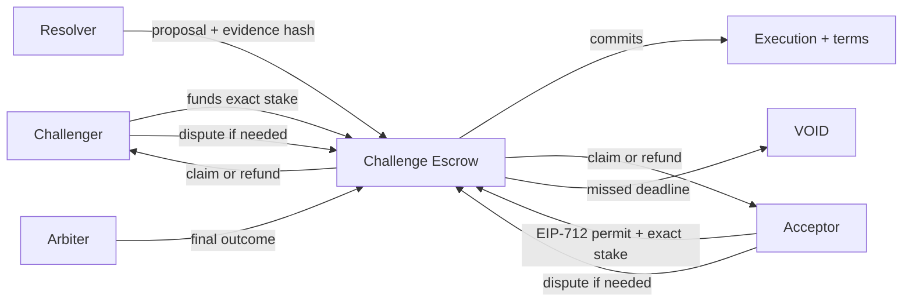

<p align="center">
  
</p>

<p align="center">
  <a href="https://github.com/Horwood/challenge-escrow-protocol/actions/workflows/verify.yml"></a>
  <a href="LICENSE"></a>
  <a href="SECURITY.md"></a>
</p>

# Challenge Escrow Protocol

> I am testing what happens when a financial challenge has to end, even when
> the people deciding the result disappear.

I designed this as a small, direct reference implementation for a two-wallet
challenge. I deliberately keep it separate from a product, an oracle, a
custody layer, a deployment kit, and any claim that real-value use is safe. I
am publishing the protocol work underneath that kind of product so the
interesting parts can stand on their own.

**Research status.** I publish unaudited code for local and testnet use with
valueless assets only. I ask you to read [my security policy](SECURITY.md)
before treating anything here as deployable.

## Start from the question you actually have

| If you want to... | I would send you to... |
| --- | --- |
| understand what I designed in ten minutes | [Protocol semantics](docs/PROTOCOL.md) |
| see why I ended up with this shape | [Research evolution](docs/EVOLUTION.md) |
| review my assumptions, failures, and remaining gaps | [Threat model](docs/THREAT-MODEL.md) and [security review](docs/SECURITY-REVIEW.md) |
| reproduce my commitments outside Solidity | [Public vectors](spec/vectors/commitments-v1.json) and [their verifier](tools/verify-vectors.mjs) |
| read or change my code | [Reading guide](docs/READING-GUIDE.md) and [contribution notes](CONTRIBUTING.md) |

## The whole idea

I designed the protocol around two named wallets that lock the same exact
amount of one ERC-20 asset against a committed execution and a committed terms
artifact. I let the contract handle accounting, authorization, deadlines, and
finality. I give a resolver the right to propose an outcome from evidence and
keep an arbiter for disputes. If either authority goes silent, I let the
protocol reach `VOID` and create refunds. Funds do not wait forever for
somebody to answer a message.



## Money, authority, and failure have separate jobs

| Part | What I let it do | What I refuse to let it do |
| --- | --- | --- |
| Contract | hold one configured token, create entitlements, enforce deadlines | interpret evidence, change its release, withdraw as an owner |
| Participants | fund, accept, dispute, claim, refund | redirect another wallet's entitlement |
| Resolver | propose `A`, `B`, or `VOID` with an evidence hash | move escrowed funds or resolve after its deadline |
| Arbiter | decide a disputed result inside a fixed window | participate financially or extend the window |
| Pauser | stop new exposure during an incident | block disputes, timeouts, claims, or refunds |

I made one opinionated choice here: I treat authority failure as a protocol
event, not an operational inconvenience. I make the financial answer to a
missed proposal or arbitration deadline deterministic.

## What I am testing here

I care about the edge conditions as much as the happy path:

- I use exact token deltas to reject fees, rebases, malformed returns, and
  deceptive token behavior that would break accounting;
- I bind wallets, asset, stake, deadlines, release, and terms bytes through
  typed commitments without putting documents on-chain;
- I bind acceptance permits to a wallet, nonce, and expiry so an acceptance
  cannot drift into another challenge;
- I use pull claims so one recipient cannot block everybody else;
- I exercise timeout exits, pause behavior, and role separation as protocol
  properties rather than leaving them in prose.

I record the local evidence in [the security review](docs/SECURITY-REVIEW.md):
41 tests, 13 invariant properties, static analysis, dependency inspection,
and secret scans. I also record what I still have not proved.

## Run my reference locally

<details>
<summary>Requirements and commands</summary>

I require Node.js 22.15.1 or newer, pnpm 10, and Foundry.

```sh
pnpm install --frozen-lockfile
pnpm check
pnpm audit:dependencies
```

`pnpm check` verifies formatting, recomputes my public commitment boundary,
builds with the pinned compiler, and runs the security profile. I include no
deployment script, and the contract reports `TESTNET_NO_VALUE` as its only
value mode.

</details>

## What I put here

I keep the protocol kernel, adversarial tests, fixed vectors, and the documents
needed to inspect their meaning. I deliberately leave interface code,
social-platform integration, deployment operations, user data, infrastructure
addresses, environment files, and private project history outside this
repository.

That boundary is part of my research. I find a protocol hard to discuss when I
leave half its work off-screen inside a product.

## Citation and license

I ask anyone using this work to cite my [citation record](CITATION.cff). I
publish the code and written research under the [MIT License](LICENSE). I list
the third-party notice for [OpenZeppelin Contracts](NOTICE.md).

## Contributors

I am Ivan Kalkaev, and I keep the research direction, protocol design, and
final responsibility. I did the implementation, security testing, research
documentation, and repository design with Codex (OpenAI).
