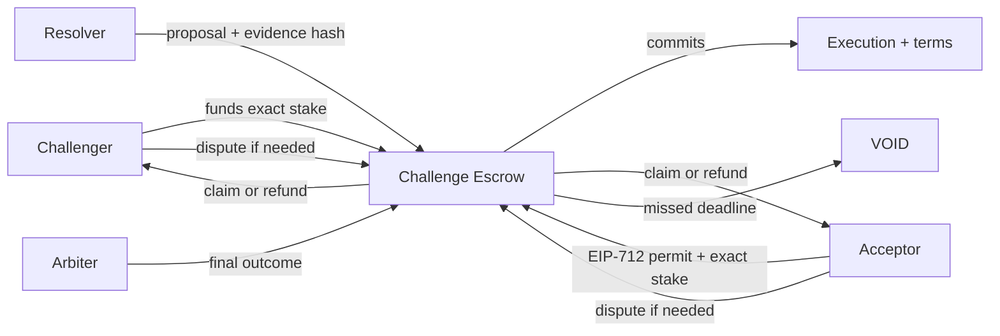

<p align="center">
  
</p>

<p align="center">
  <a href="https://github.com/Horwood/challenge-escrow-protocol/actions/workflows/verify.yml"></a>
  <a href="https://github.com/Horwood/challenge-escrow-protocol/releases"></a>
  <a href="LICENSE"></a>
  <a href="SECURITY.md"></a>
</p>

# Challenge Escrow Protocol

> A two-wallet escrow protocol with committed terms, evidence-linked resolution,
> deterministic timeout exits, and pull-based settlement.

This repository isolates the protocol layer of a financial challenge product.
It is deliberately separate from any interface, oracle, custody layer,
deployment kit, or claim that real-value use is safe.

**Research status:** unaudited code for local and testnet use with valueless
assets only. The conditions that must precede any deployment are listed in the
[security policy](SECURITY.md).

## Start with the question

| Question | Start here |
| --- | --- |
| What does the protocol do? | [Protocol semantics](docs/PROTOCOL.md) |
| Why does it have this shape? | [Research evolution](docs/EVOLUTION.md) |
| What can fail, and what remains unproved? | [Threat model](docs/THREAT-MODEL.md) and [security review](docs/SECURITY-REVIEW.md) |
| Can the commitments be reproduced outside Solidity? | [Public vectors](spec/vectors/commitments-v1.json) and [their verifier](tools/verify-vectors.mjs) |
| How are terms and evidence made portable? | [Portable semantics](docs/PORTABLE-SEMANTICS.md), [error catalog](docs/PORTABLE-ERROR-CATALOG.md), and [conformance artifacts](spec/README.md) |
| How is an observer run made reproducible? | [Observer receipts](docs/OBSERVER-RECEIPTS.md) and [observer implementation notes](tools/client/OBSERVER.md) |
| What assumptions sit behind operational authority? | [Authority policy](docs/AUTHORITY-POLICY.md) |
| Which exact source and runtime were reviewed? | [Release attestation](docs/RELEASE-ATTESTATION.md) |
| What changed in the latest research cycle? | [Depth cycle 3](docs/DEPTH-CYCLE-3.md) |
| How should the code be read or changed? | [Reading guide](docs/READING-GUIDE.md) and [contribution notes](CONTRIBUTING.md) |

## The whole idea

Two named wallets lock the same exact amount of one ERC-20 asset against a
committed execution and a committed terms artifact. The contract handles
accounting, authorization, deadlines, and finality. A resolver proposes an
outcome from evidence; a separate arbiter handles disputes. If either authority
goes silent, the protocol reaches `VOID` and creates refunds. Funds do not wait
forever for somebody to answer a message.


```mermaid
flowchart LR
    A["Challenger"] -->|"funds exact stake"| E["Challenge Escrow"]
    B["Acceptor"] -->|"EIP-712 permit + exact stake"| E
    E -->|"commits"| C["Execution + terms"]
    R["Resolver"] -->|"proposal + evidence hash"| E
    A & B -->|"dispute if needed"| E
    U["Arbiter"] -->|"final outcome"| E
    E -->|"claim or refund"| A & B
    E -->|"missed deadline"| V["VOID"]
```

## Money, authority, and failure have separate jobs

| Part | Allowed | Excluded |
| --- | --- | --- |
| Contract | hold one configured token, create entitlements, enforce deadlines | interpret evidence, change its release, withdraw as an owner |
| Participants | fund, accept, dispute, claim, refund | redirect another wallet's entitlement |
| Resolver | propose `A`, `B`, or `VOID` with an evidence hash | move escrowed funds or resolve after its deadline |
| Arbiter | decide a disputed result inside a fixed window | participate financially or extend the window |
| Pauser | stop new exposure during an incident | block disputes, timeouts, claims, or refunds |

The opinionated part is treating authority failure as a protocol event, not an
operational inconvenience. A missed proposal or arbitration deadline has a
deterministic financial answer.

## What is being tested

The edge conditions matter as much as the happy path:

- exact token deltas reject fees, rebases, malformed returns, and
  deceptive token behavior that would break accounting;
- typed commitments bind wallets, asset, stake, deadlines, release, and terms
  bytes without putting documents on-chain;
- acceptance permits bind a wallet, nonce, and expiry so an acceptance
  cannot drift into another challenge;
- pull claims keep one recipient from blocking everybody else;
- timeout exits, pause behavior, and role separation are executable protocol
  properties rather than leaving them in prose;
- an N-provider RPC quorum retains supporters, dissenters, outages, and
  parent-hash forks instead of silently trusting one endpoint;
- the observer rejects non-canonical event payloads, impossible outcome/reason
  pairs, and inputs that exceed explicit local resource limits;
- authority epochs, thresholds, custody separation, and forbidden powers are
  machine-readable without publishing keys, and every role threshold must be a
  strict majority; and
- a deterministic release manifest binds the reviewed sources, schemas,
  vectors, ABI, and deployed runtime and is verified by two implementations.

The [security review](docs/SECURITY-REVIEW.md) records the local evidence:
52 tests, 13 invariant properties, ten bounded Halmos properties, 24
observer-receipt rejection cases in two implementations, 19 authority-policy
rejection cases, 512 differential quorum cases, a 12-for-12 mutation baseline,
an exact 43-function compiled authority surface, static analysis, dependency
inspection, and secret scans. It also records what remains unproved.

## Run it locally

<details>
<summary>Requirements and commands</summary>

Requirements are Node.js 22.15.1 or newer, pnpm 10, Foundry, and Deno 2.7.3.
The full portable semantics gate also uses the pinned Rust toolchain in
`rust-toolchain.toml`.

```sh
pnpm install --frozen-lockfile --ignore-scripts
pnpm check
pnpm audit:dependencies
```

For the portable boundary:

```sh
rustup toolchain install 1.97.1 --profile minimal --component rustfmt,clippy
pnpm run check:depth2
```

That gate runs the Solidity baseline, schema checks, JavaScript/Python/Rust
conformance implementations, the twelve-case negative corpus, and the
locked dependency audit.

For the complete current research boundary:

```sh
pnpm run check:depth3
```

That adds the contract-coupled symbolic properties, N-provider observer and
receipt checks, a 512-case differential quorum corpus, the independent Python
receipt verifier, authority-policy and incident corpora, a block-hash-pinned
read-only testnet boundary, deterministic supply-chain checks, and
two-implementation release-manifest verification.

For the heavier local security review, `pnpm run audit:baseline` also runs
Medusa, Gitleaks, Semgrep, and the exact Slither finding gate. It records every
tool version and fails if the reviewed analyzer versions drift. The
[audit package](docs/AUDIT-PACKAGE.md) documents the remaining non-hermetic
package and remote-rule inputs.

For a read-only Sepolia or Base Sepolia inspection, use the safety boundary
in [`tools/testnet/README.md`](tools/testnet/README.md). The local test suite
proves that it rejects credentials, write RPC methods, unsafe URLs, wrong
chains, credential-bearing URL paths, non-`TESTNET_NO_VALUE` release events,
code drift, and inconsistent immutable substitutions before it receives any
endpoint or address.

`pnpm check` verifies formatting, recomputes the public commitment boundary,
builds with the pinned compiler, and runs the security profile. The repository
includes no deployment script, and the contract reports `TESTNET_NO_VALUE` as
its only value mode. `pnpm run size:check` enforces the EIP-170 deployed-bytecode
limit.

</details>

## Repository boundary

The repository contains the protocol kernel, adversarial tests, fixed vectors,
and the documents needed to inspect their meaning. It deliberately leaves
interface code, social-platform integration, deployment operations, user data,
infrastructure addresses, environment files, and private project history outside
this repository.

That boundary is part of the research. A protocol is hard to discuss when half
of its work stays off-screen inside a product.

## Citation and license

If this work informs another project, use the [citation record](CITATION.cff).
The code and written research are published under the [MIT License](LICENSE).
Third-party attribution for OpenZeppelin Contracts is in [NOTICE.md](NOTICE.md).

## Contributors

| Contributor | Work |
| --- | --- |
| [Ivan Kalkaev](https://github.com/Horwood) | Research direction, protocol design, and final decisions |
| Codex (OpenAI) | Implementation, security testing, research documentation, and repository design |
