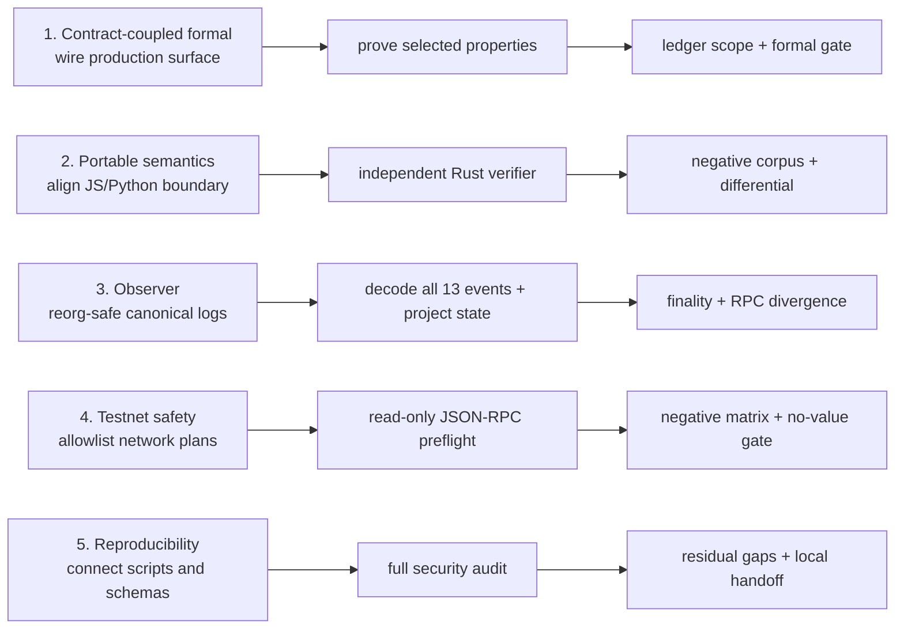

# Depth cycle 2

This note keeps the second research cycle reproducible. Each lane has three
dependent stages and closes with a small gate before the next lane begins. This
is a research record, not a deployment checklist.

## Lane 1: contract-coupled formal boundary

1. Halmos was wired to the production `ChallengeEscrow` surface and the exact
   commitment libraries.
2. Five selected delegation and arithmetic properties completed with zero
   counterexamples.
3. The assumptions and non-claims were recorded in the proof ledger and security
   review.

Gate: `pnpm run check:depth1` plus the five-property `formal:contract` run.

## Lane 2: portable semantics

1. The JavaScript and Python canonical validators and error rules were tightened.
2. An independent Rust parser, canonicalizer, condition evaluator, and CLI was
   built without importing the JavaScript implementation.
3. Twelve negative cases and a three-way differential comparison cover
   hashes, canonical byte counts, and condition results.

Gate: `pnpm run check:depth2`.

## Lane 3: observer and event reconciliation

1. Block-hash-anchored logs and rollback/replay remain separate from financial
   authorization.
2. Every published v1 event is decoded into projected lifecycle state,
   evidence hashes, payouts, and explicit anomalies.
3. Finality labels and a dual-RPC comparator fail closed when
   `safe` or `finalized` tags are missing, divergent, or unavailable.

Gate: `pnpm run client:check`, `pnpm run schemas:check`, and the in-memory reorg
and RPC fault fixtures.

## Lane 4: safe testnet boundary

1. Sepolia and Base Sepolia are allowlisted, with a read-only plan and an
   explicit deployment block.
2. The optional endpoint command is limited to `eth_chainId`, `eth_getCode`,
   `eth_call`, and `eth_getLogs`; it rejects credentials, query strings,
   oversized responses, and all write methods.
3. Bytecode, the `ReleaseDeclared` event, immutable getters, and
   `TESTNET_NO_VALUE` were reconciled in memory-only negative tests.

Gate: `pnpm run testnet:check`. This release used no live endpoint or address,
so no network or transaction was performed.

## Lane 5: reproducible handoff and security review

1. Schemas, commands, CI checks, documentation, and the audit manifest were
   connected without changing `contracts/src`.
2. The 22-step local audit covered protocol tests, the model, formal checks,
   portable implementations, observer, testnet boundary, simulator, liveness,
   mutation, Medusa, secret scans, static analysis, and dependency audit.
3. The record includes the one unhit but formally dominated production branch,
   the remaining medium callback warning, the absence of a third-party audit, and
   the fact that live-chain conditions remain open.

Gate: `pnpm run audit:baseline`, followed by `git diff --check` and a production
source diff check. The work was first recorded as three local commits on
`codex/v1-depth-cycle-2` and later included in the public research release.

## What this cycle does not claim

This cycle does not claim a third-party audit, live-chain finality,
key-management review, incident-response readiness, arbitrary-token
correctness, or permission to use assets of value. The artifacts make those
gaps visible and testable in the next cycle.
