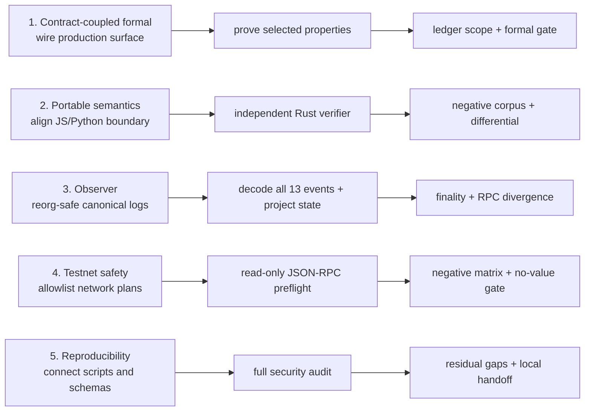

# Depth cycle 2

I use this note to keep the next research portion reproducible. Each lane has
three dependent stages. I run the small gate after a lane closes before I move
to the next one. This is a research record, not a deployment checklist.

## Lane 1 — contract-coupled formal boundary

1. I wired Halmos to the production `ChallengeEscrow` surface and the exact
   commitment libraries.
2. I proved five selected delegation and arithmetic properties with zero
   counterexamples.
3. I recorded the assumptions and non-claims in the proof ledger and security
   review.

Gate: `pnpm run check:depth1` plus the five-property `formal:contract` run.

## Lane 2 — portable semantics

1. I tightened the JavaScript and Python canonical validators and error rules.
2. I built an independent Rust parser, canonicalizer, condition evaluator, and
   CLI without importing the JavaScript implementation.
3. I added twelve negative cases and a three-way differential comparison of
   hashes, canonical byte counts, and condition results.

Gate: `pnpm run check:depth2`.

## Lane 3 — observer and event reconciliation

1. I kept block-hash anchored logs and rollback/replay separate from financial
   authorization.
2. I decoded every published v1 event and projected lifecycle state,
   evidence hashes, payouts, and explicit anomalies.
3. I added finality labels and a dual-RPC comparator that fails closed when
   `safe` or `finalized` tags are missing, divergent, or unavailable.

Gate: `pnpm run client:check`, `pnpm run schemas:check`, and the in-memory reorg
and RPC fault fixtures.

## Lane 4 — safe testnet boundary

1. I allowlisted Sepolia and Base Sepolia and required a read-only plan with an
   explicit deployment block.
2. I limited the optional endpoint command to `eth_chainId`, `eth_getCode`,
   `eth_call`, and `eth_getLogs`; it rejects credentials, query strings,
   oversized responses, and all write methods.
3. I reconciled bytecode, the `ReleaseDeclared` event, immutable getters, and
   `TESTNET_NO_VALUE` in memory-only negative tests.

Gate: `pnpm run testnet:check`. I have not supplied a live endpoint or address
in this release, so no network or transaction was performed.

## Lane 5 — reproducible handoff and security review

1. I connected schemas, commands, CI checks, documentation, and the audit
   manifest without changing `contracts/src`.
2. I ran the 22-step local audit: protocol tests, model, formal checks,
   portable implementations, observer, testnet boundary, simulator, liveness,
   mutation, Medusa, secret scans, static analysis, and dependency audit.
3. I documented the one unhit but formally dominated production branch, the
   remaining medium callback warning, the absence of a third-party audit, and
   the fact that live-chain conditions remain open.

Gate: `pnpm run audit:baseline`, followed by `git diff --check` and a production
source diff check. The result is three local commits on
`codex/v1-depth-cycle-2`; I did not push them.

## What this cycle does not claim

I do not claim a third-party audit, live-chain finality, key-management review,
incident-response readiness, arbitrary-token correctness, or permission to use
assets of value. The artifacts are designed to make those gaps visible and
testable in the next cycle.
