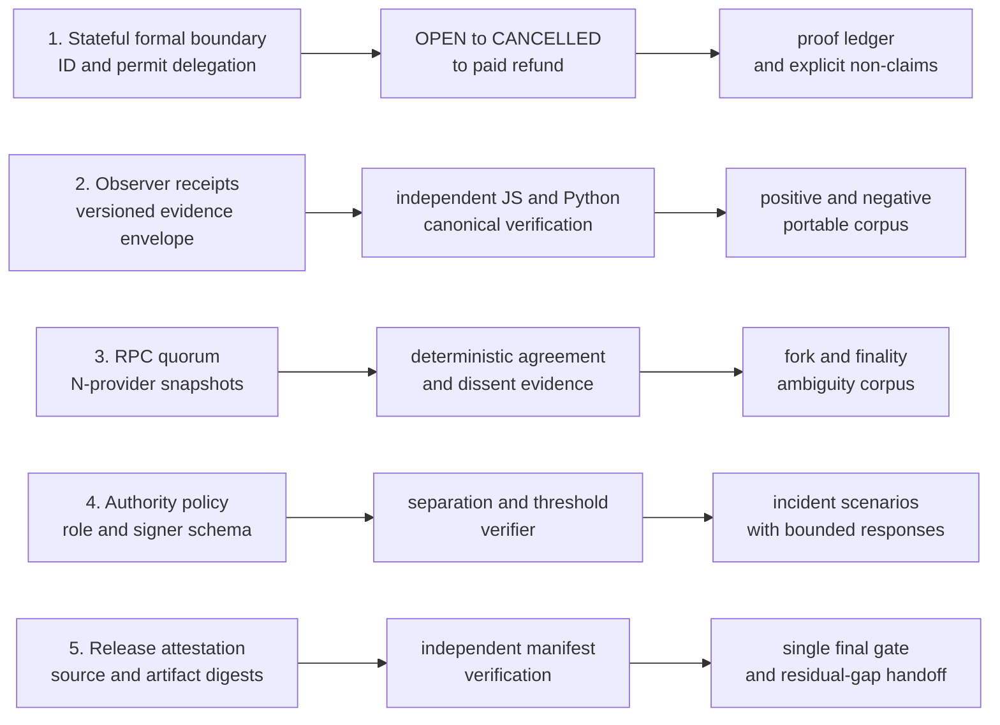

# Depth cycle 3

I use this cycle to connect five assurance boundaries that are still separate in
the current research release. The cycle starts with contract state, carries the
result through portable observer evidence and RPC agreement, makes authority
assumptions machine-readable, and closes with a reproducible release
attestation.

I implement the stages in order and defer test execution until the complete
cycle is wired. This keeps intermediate fixtures and interfaces free to change
without turning every iteration into a compatibility exercise. The final gate
runs the complete existing audit plus the new cycle checks once the five lanes
are integrated.



## Lane 1 — stateful formal boundary

1. I extend the contract-coupled Halmos harness across the production challenge
   identifier, entitlement identifier, acceptance-permit type hash, and permit
   digest surfaces.
2. I add a bounded stateful property using an exact-behavior token: a valid
   challenge moves from `OPEN` to `CANCELLED`, creates one refund entitlement,
   pays it once, and returns both challenge and aggregate liability to zero.
3. I update the machine ledger and the human proof ledger with the exact
   preconditions, tool bounds, proved statements, and lifecycle properties that
   remain outside the proof.

Exit evidence: the production release surface is called directly, the stateful
property has no shadow-contract implementation, and every new proof has a
stable ledger ID.

## Lane 2 — portable observer receipts

1. I define `challenge-escrow.observer-receipt/v1` as a closed envelope for a
   release identity, observed head, finality evidence, canonical log digest,
   projected-state digest, anomaly digest, and RPC quorum result.
2. I implement canonical receipt construction in JavaScript and an independent
   Python verifier that does not import the TypeScript observer or JavaScript
   implementation.
3. I publish one positive vector and a machine-readable negative corpus for
   duplicate keys, non-canonical decimals, reordered providers, altered heads,
   stale release identity, digest mismatch, and hidden anomaly changes.

Exit evidence: both implementations reproduce the same canonical bytes and
domain-separated receipt hash, while every negative case fails with a stable
error code.

## Lane 3 — RPC quorum and fork evidence

1. I generalize the current two-endpoint comparison into an endpoint-neutral
   `N`-provider snapshot containing `latest`, `safe`, and `finalized` block
   references for every available provider.
2. I select an agreed head only when a configured threshold supports one exact
   block number, hash, and parent hash. I preserve dissent and outage evidence
   instead of silently dropping minority providers.
3. I cover two-of-three agreement, split quorum, missing finality tags, stale
   providers, parent-hash forks, competing finalized groups, and complete
   outage as deterministic receipt inputs. Ambiguity remains `conflicted` or
   `unavailable`; it never becomes a financial authorization.

Exit evidence: provider URLs and credentials never enter the report, provider
ordering cannot change the result, and no finality label is inferred from a
`latest` head.

## Lane 4 — authority and key-policy boundary

1. I define a versioned authority-policy schema with epochs, role groups,
   signer fingerprints, thresholds, validity bounds, predecessor lineage, and
   an explicit list of forbidden capabilities.
2. I implement a static verifier that rejects zero or duplicate signers,
   cross-role control overlap, impossible thresholds, weak single-member
   quorums, broken epoch lineage, and owner, withdrawal, payout-redirection, or
   upgrade authority.
3. I model member loss, signer compromise, quorum loss, pauser loss, and stale
   policy replay. Each scenario produces a bounded response or a fail-closed
   result without accepting secret material.

Exit evidence: the policy artifact contains no private key, mnemonic, endpoint,
or live address, and every accepted policy preserves resolver, arbiter, and
pauser separation at the controller-fingerprint level.

## Lane 5 — reproducible release attestation

1. I generate a versioned manifest over production Solidity sources, compiler
   and optimizer settings, runtime bytecode, ABI, schemas, vectors, proof
   ledger, and the new observer and authority artifacts.
2. I verify the manifest independently from sorted file bytes and compiled
   artifacts, including raw and immutable-normalized runtime hashes, the six
   public immutable groups, and SHA-256 digests of the public research
   boundary.
3. I wire the cycle into package commands, CI-facing documentation, the threat
   model, security review, audit package, reading guide, and README. I then run
   the single complete validation and security pass, fix any failures, and
   record only evidence actually produced by that run.

Exit evidence: a reviewer can identify the exact source, schemas, vectors,
proof ledger, ABI, and runtime bytecode represented by one manifest without a
deployment key or network endpoint.

## Final validation policy

I do not run lane-by-lane test gates during implementation. After all fifteen
stages are present, I run one integrated sequence:

```text
pnpm run prepare:depth3
```

That command regenerates the two golden vectors, builds the pinned compiler
artifact, and writes the deterministic release manifest. It is release
preparation rather than a passing test. I then run:

```text
pnpm run check:depth3
pnpm run audit:baseline
git diff --check
```

If that pass exposes an integration or security defect, I correct the defect
and rerun the affected command plus the complete depth-cycle gate. I do not
describe this work as a third-party audit, live-chain validation, key ceremony,
incident-response exercise, or permission to use assets of value.

## Executed result — 2026-08-09

| Lane | Recorded evidence |
| --- | --- |
| Stateful formal boundary | `10/10` Halmos properties, including the bounded open/cancel/refund path and release-ID binding, with zero counterexamples |
| Portable observer receipt | JavaScript and Python agree on `4,692` canonical bytes and one receipt hash; `24/24` negative cases reject |
| RPC quorum | `512` differential cases keep the TypeScript and receipt implementations aligned across two to six providers; fork, finality, dissent, and outage evidence remain explicit |
| Authority policy | three roles, eight synthetic members, five incident decisions, strict-majority thresholds, an enforced announcement delay, and `19/19` negative policies reject |
| Release attestation | JavaScript and Python agree over seven production sources, 126 public artifacts, a 23,270-byte runtime, six immutable groups with 24 substitutions, and a 140-entry ABI; a separate gate fixes all 43 public functions and 14 writable entry points; compiler metadata is matched back to every production source |

The first integrated depth gate exposed four ordinary integration defects: an
overly strict receipt-head helper, the post-payment entitlement expectation in
the stateful proof, a non-hex block fixture, and an imprecise lineage error
code. I corrected those before the security pass.

A later adversarial review found problems in the evidence around the code, not
only in the code itself. I made observer synchronization atomic, ignored
untrusted `removed` hints, validated header ancestry, bounded observer resource
use, preserved simultaneous RPC conflict and outage evidence, rejected
non-canonical event semantics, pinned testnet reads to one block hash, closed the
provider-error vocabulary, required strict-majority authority thresholds, and
made the formal, coverage, mutation, model, simulator, and Medusa runners prove
that their expected checks actually ran. Medusa now reports four required
properties separately from 36 auxiliary panic targets instead of presenting a
flat `40/40` claim.

The final manual pass closed three more trust-boundary gaps. I made direct
state inspection reject role-overlapping participants, aggregate-liability
contradictions, non-canonical absent tuples, and false arbiter identities. I
made the projector reject mixed contracts, same-height forks, duplicate event
positions, schedule drift, and terminal results that do not match their
proposal or dispute lineage. Finally, I preserved compiler immutable groups in
the release manifest and made the testnet preflight compare every repeated live
substitution with its group and public getter instead of trusting one getter
alongside a flat normalized runtime hash. I also tightened the projector to the
exact proposal and dispute windows, required the release declaration to precede
the projected lifecycle, and upgraded the testnet snapshot from a block number
to a rechecked canonical block hash.

The closing supply-chain review fixed another evidence gap: the complete audit
now rejects drift from the exact Z3, Medusa, Gitleaks, Semgrep, and Slither
versions used for this result, while the Halmos runner names its top-level
version explicitly. I still record that this is not a hermetic analyzer image:
external binaries, transitive Halmos distributions, and remote Semgrep profiles
are not content-addressed by this repository.

That same review found one reproducibility defect in the initial manifest: a
generated formal cache below `tools/` was ignored by Git but still entered the
hashed public-artifact set after a local proof run. Its digest depended on local
paths and timestamps. Both manifest implementations now exclude and reject that
cache, and the schema gate rejects duplicate keys across the remaining public
JSON before parsing.

The event projector now also recomputes every payout entitlement ID from its
challenge ID and wallet. I kept the Keccak-256 implementation dependency-free,
bound it to fixed public vectors, and compare 128 deterministic cases with
Foundry `cast`; its Deno subprocess permission is limited to that executable.
The last concurrency pass serializes overlapping observer synchronizations and
freezes logs beside the reconciled head before any direct-state await. Every RPC
provider snapshot now rechecks its latest block hash, and event identity uses
the block-global log index rather than trusting a provider-supplied transaction
index. I require compound state inspection at an explicit block, stop on an
accounting contradiction, reject nonzero fields behind absent nested-state
flags, reject participant overlap with the declared release, and reject a
non-exempt early `VOID` proposal before the source-correction cutoff. Authority
rotations now hash their announcement time and must actually remain reviewable
for the declared minimum delay.

The closing integrated run found two test-evidence defects and one portability
defect in the audit wrapper. The differential quorum fixture represented an RPC
outage without declaring the finality-tag method, so the two implementations
correctly assigned different public error codes; I made the synthetic provider
fail through the same declared interface. Mutation `M-06` then survived because
the suite checked an early call and the exact deadline but not the final second
before it; I added the missing `deadline - 1` rejection and killed all 12
mutations. Finally, Z3 reported the required `4.16.0` version with a platform
bitness suffix; I now ignore only that standard suffix while retaining and
checking the exact semantic version.

After those corrections, `check:depth3` passed from a clean restart and the
separate audit passed all 29 checks. Gitleaks found no secret in either Git
history or the worktree, Semgrep found no match under the selected local,
security-audit, and secret rules, the locked dependency audit found no known
high-severity vulnerability, and Slither produced the exact pinned 25-finding
inventory with zero high-severity finding.
